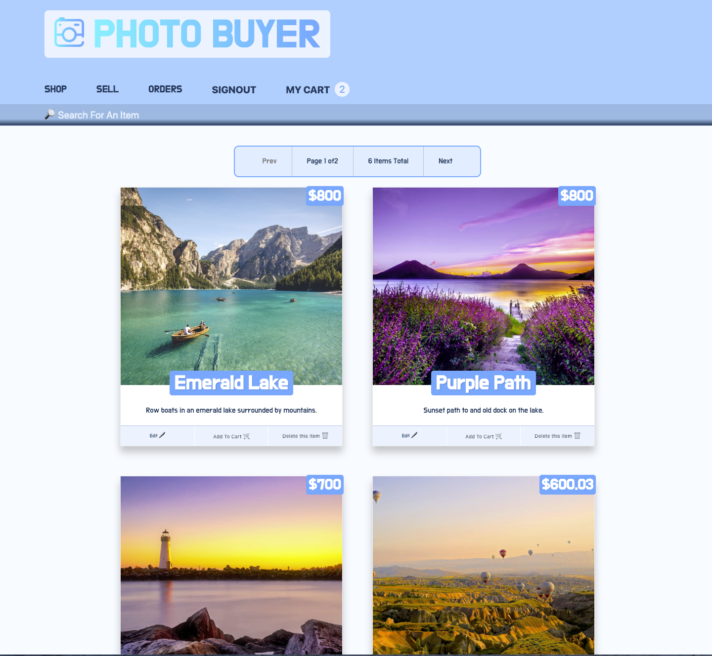
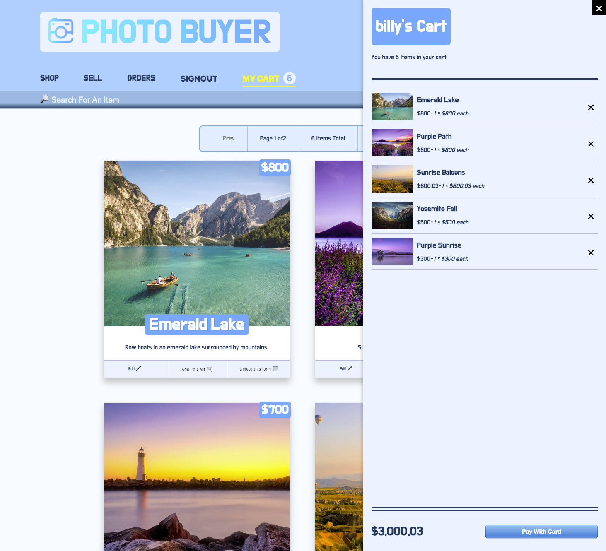
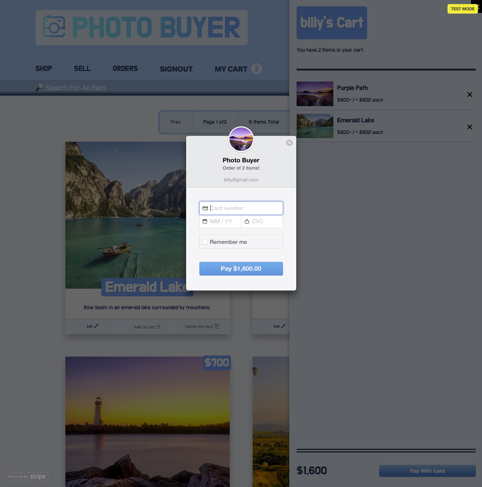
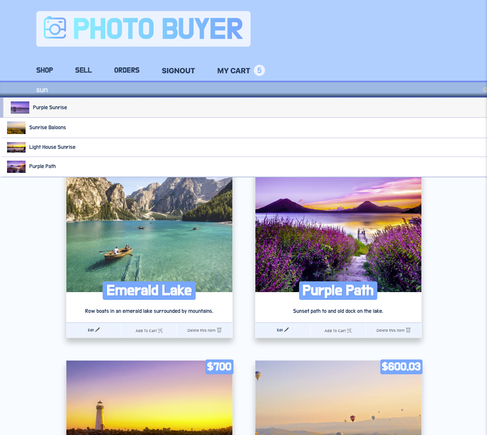
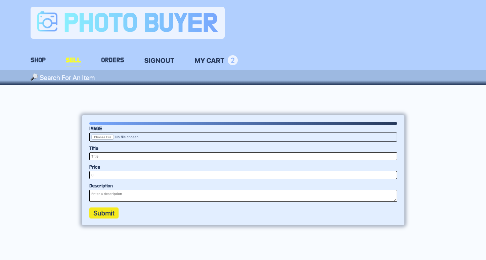
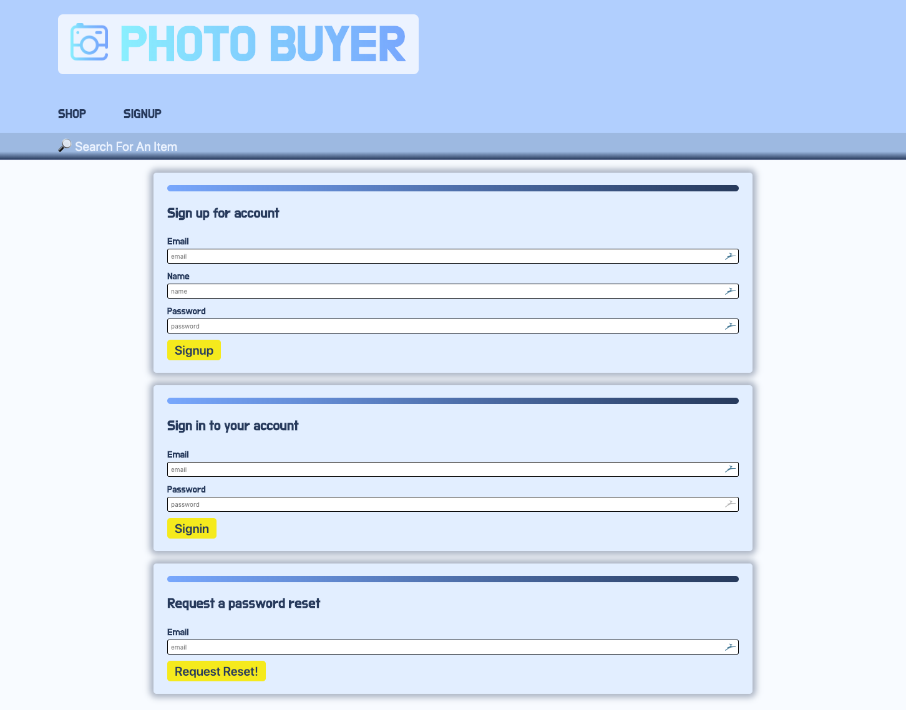
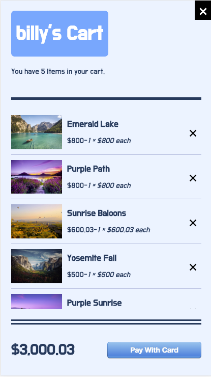
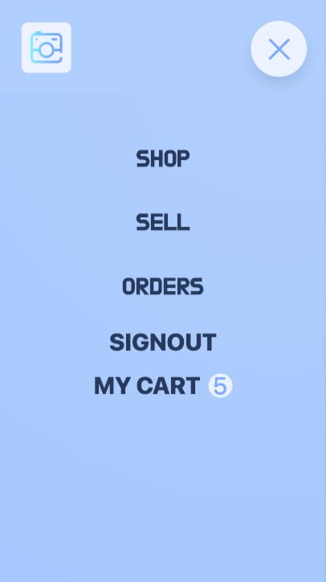

# Photo Buyer FE

Photo Buyer allows users to upload, purchase, and edit photos. It also allows users to sign in and create an account that saves their information to a [Prisma](https://www.prisma.io/) database and hosts images on [Cloudinary](https://cloudinary.com/). Photo Buyer was built with [React](https://reactjs.org/) using [Apollo Client](https://www.apollographql.com/docs/react/) to fetch data with [GraphQL](https://graphql.org/) and perform mutations while using a [GraphQl Yoga](https://github.com/prisma/graphql-yoga)server. Users and buyers can make secure purchases through [Stripe](https://stripe.com/) and save their orders to the database. Photo Buyer is tested with [Jest](https://jestjs.io/) using the assertion library [Enzyme](https://airbnb.io/enzyme/).

## Set Up

#### Installation

1.  `git clone https://github.com/chrisboylen/Photo-Buyer-FE.git`
1.  `git clone https://github.com/chrisboylen/Photo-Buyer-BE.git`
1.  `npm install -g prisma`
1.  `cd Photo-Buyer-BE`
1.  `touch variables.env`

#### Test Suite

- Run the following command --> `npm test`

## Result

## Contributor

- [Chris Boylen](https://github.com/chrisboylen)
